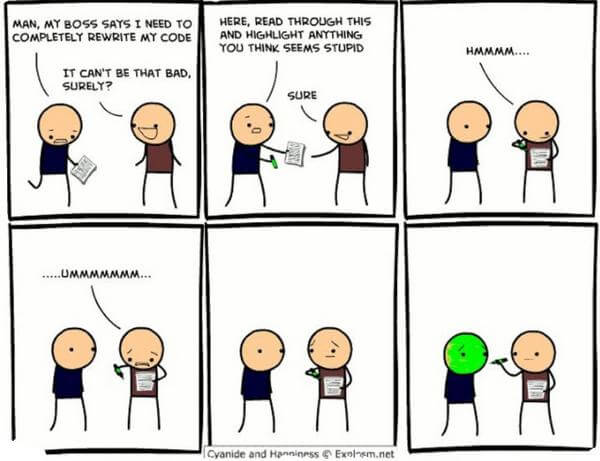

## Coding Standards

When it comes to coding, people often think the only important thing is to just implement the task successfully. Definitely yes, writing code that works is the number one thing a programmer should focus on. I mean, what good is a piece of code that doesn't do what it is supposed to do? Many people overlook the importance of the format and style. Just like writing an essay, where to put spaces, where to indent, when to enter a new line are all crucial in a piece of code. An essay may be very interesting, engaging, and informative, but if everything was written in one long paragraph, no one would want to read it. It quickly looses its value.

If there were thousands of lines of code not properly named, spaced, or indented, it would be impossible to read and know what particular section is trying to do what. Yes, the code may work perfectly fine, but this leads to limitations and inefficiencies. Readability of source code has a huge impact on developers. It allows modifying and adding features to a software system very easily. This would take hours with messy code because you would spend a great amount of time looking for where and what to change. 

Coding standards like ESLint do emphasize appearance, but it is much more than just looking neat. Having a coding standard helps projects to be harmonized as if it were written by a single person in one sitting. Coding standards also help to prevent or find little mistakes that many people will go about without even realizing it until they run the program. Coding standards ensure a group of developers to produce quality code. 

Working with ESLint helped me to write better code that would minimize any complications later on. For example, it would notify me if I have never reassigned a variable and suggests to change it to a const instead of let. This helped me realize what variables were meant to stay constant and prevents me from changing it if I got confused throughout my code. It also specifies me to delete unnecessary lines of code. Although these are very little things, it adds up and is especially very helpful in big projects. Having no standards in the coding world is just as bad as having no standards in the dating world.

