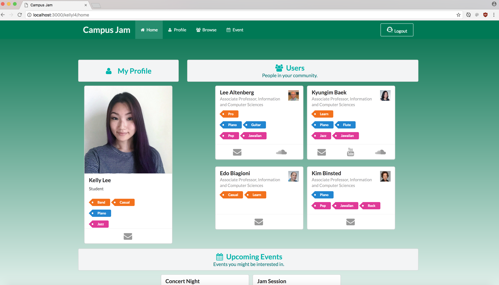
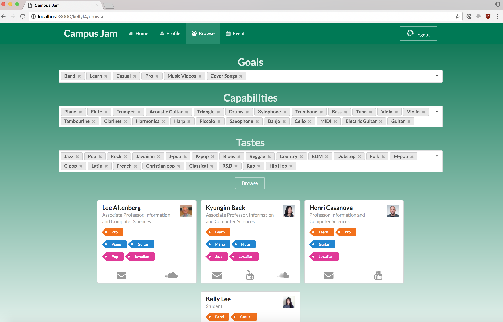

## App Overview

Campus Jam is a group project created in ICS 314, a software engineering course. After learning the basics of Javascript, Semantic UI, and HTML/CSS, Professor Johnson assigned us into groups of three to create a web application for the University of Hawaii community using the Meteor Framework. My group decided to create an app that will bring people interested in music together. Anyone with a UH account can login and create a profile. After creating a profile, community members can browse for other profiles with specific musical goals, tastes, and capabilities. 

<ul>
<li>Goals: What they want to gain from this site. This can range from wanting to learn an instrument to looking for members to form a band.</li>
<li>Tastes: Music genres they are interested in (classical, jazz, hip hop, etc.).</li>
<li>Capabilites: Musical instruments they are able to play.</li>
</ul>

This will allow them to contact the user that results from the search through email, whether it is to ask them to create a band, have a casual music session, or to just make a new friend with similar interests. Aside from browsing profiles, members are also allowed to create events such as having a jam session. These events will include information such as the description of the event, location, time, music genre, and what instruments they are looking for. Members will be able to contact the person who created the event by clicking on their mail icon. A user's homepage will allow them to view other user's profiles in their community along with upcoming events. As you can see, the goal was to create a social networking app for not just musicians, but for anyone interested in music.

## My Contribution

I was assigned to work on the browse page, landing page, and the tastes collection. The tastes collection keeps track of the musical tastes for each profile. The landing page is the initial page anyone will see when going to the website. It includes a general description of what the app is meant for and has the login button for UH community members to sign in. The browse page has three drop downs for each catogory to be searched. The bottom of the browse page contains users that result from the search. Although each member of the group was assigned a specifc task and page to work on, we ended up contributing and helping with one another's assigned issue to resolve them quickly. "Team work makes the dream work".

## Learning Experience

Through this project, I got a better understanding of Javascript, HTML/CSS, Meteor Framework, and Semantic UI. This project forced me to take everything I learned from this course and apply it all into this Campus Jam app. Aside from brushing up on these skills, I learned how to work in a group with the use of Github. This was a great learning experience because now I know when and how to merge, pull, push, and sync from different issues into the master branch. It took awhile to get used to the process, but thanks to my group members who have walked me through each step when pulling and merging for the first couple times, I have mastered this technique. I discovered that working as a group is very difficult, because although we are all assigned to different issues to work on, everything in the app is somehow connected to another. To make things work, we made sure to communicate well with each other and meet frequently to make sure everything flowed perfectly and each page and collection were compatible. Another great take away was learning to create milestones and issues within those milestones. This allowed the development of our project to be very organized. I enjoyed working on this final project because I learned a lot about github and working as a team. 

If you are interested in Campus Jam, you can find more information on it through our [Github](https://campusjam.github.io/) page.
