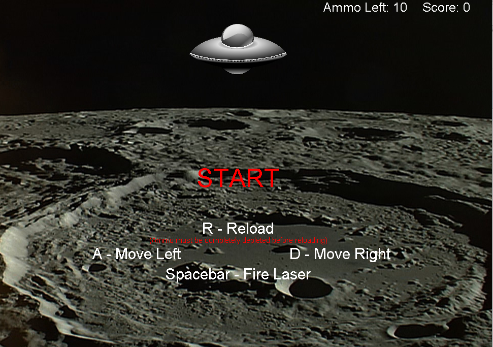

  

ICS 111 is the intro course to Computer Science. Before this course, I had no experience with coding in Java or any other programming languages. This class was definitely something totally new to me and I didn't know what to expect. Due to not having any prior knowledge or experience in programming, I struggled a lot in this course. But after a few projects in, I enjoyed the challenges and got more comfortable with Java. For the final project in ICS 111, students were to form groups and were given the freedom to program anything they wanted as a team utilizing the EZ java class created by Dylan Kobayashi. I worked with my two classmates, Jamie Tang and Jonathin Chin. We decided to create a spaceship shooting game where the objective of the game was to shoot lazers at the aliens on the bottom of the screen. The more aliens the player shoots, higher the score gets. Shooting the smaller aliens will give more points than the bigger aliens. Bonus points are also provided if the player is able to shoot a very rare and quick spaceship that crosses the screen. The player is given 10 tries to shoot and then has the choice to reload when there are no more tries left.

This was my first time working in a group to create a programming project. It was a bit difficult at first because we were unsure of how to divide the work. After discussing about our game plan, I became in charge of the aliens, Jamie was in charge of the lazer, Jonathan was in charge of the spaceship, and we all contributed to the main class. Working in a group was challenging because we would have to discuss how we would implement these tasks and what functions we were going to include so our codes would flow nicely and be compatable with each other's. We faced many obstacles creating this project, but worked as a team and helped each other out. After completeing this project, I realized that programming with a team is a total different experience than programming alone. Working in a group involves a lot of compromising and also requires patience. 

[Click here](https://youtu.be/miRbHqi0pIg) to see a demonstration of the game.

