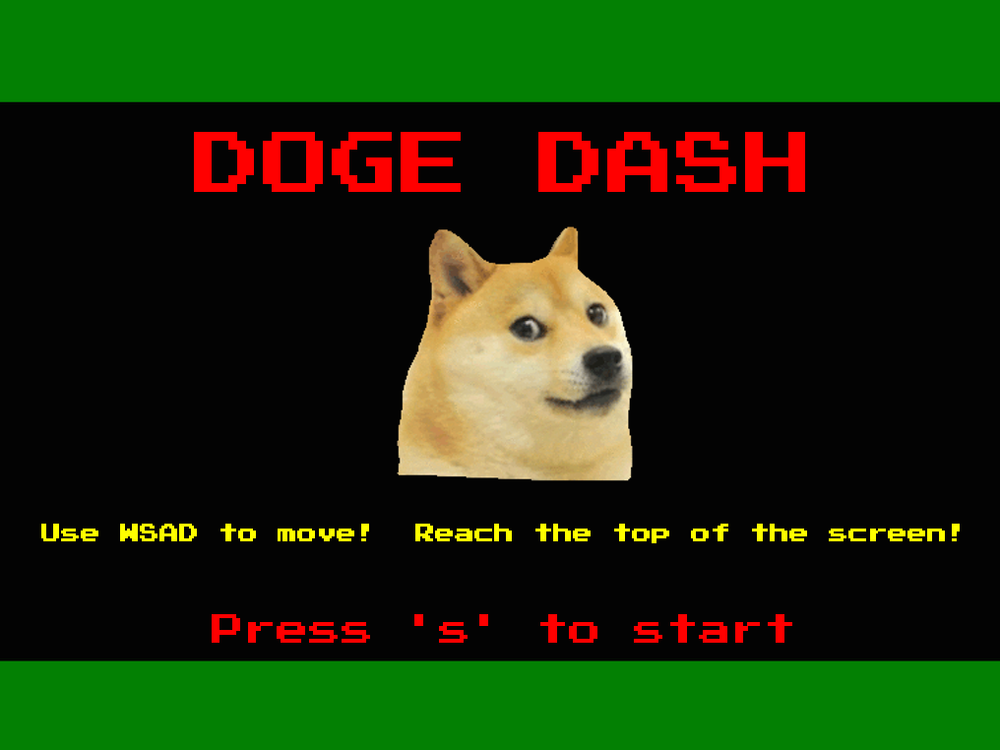

Doge Dash is a game that I helped create as a team project in ICS 111. The game is written in Java and using Eclipse. The objective of the game is to not get hit and safely get to the other side. Once the player manages to get to the other side, an option is given to either quit the game or move onto the next level. It was nice working in a group because when we did not know how to do a certain task, or didn't know why our code was not working, we would work as a team and try to fix the problem. One person would throw something in and then another person would add on to that, and so forth. Soon, one by one, we were knocking out bugs and finally got the code to do what we wanted. We did run into obstacles where one of us wanted something to be a certain way while the other disagreed, but nonetheless, we learned how to work together. After completing this project, I realized that programming with a team is a total different experience than programming alone. Working in a group involves a lot of compromising and also requires patience. This project not only challenged me to apply everything I learned about Java in this one game, but also taught me the skill of working as a team.
 
Source: <a href="https://github.com/theVacay/vacay"><i class="large github icon"></i>theVacay/vacay</a>
