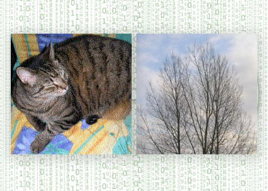

In Fall 2016, I was required to do a mini-project for my Security and Trust class on a topic we learned in class. Steganography is an implementation of covert channels. Steganography takes a normally harmless piece of data and hides the secret data within it. The sender and receiver uses steganography to keep from being detected by any outsiders. There are different forms of steganography. You can hide messages in texts/documents, images, audios, or videos. Digital photo steganogrphy uses inumportant bits as places to hide encoded messages or images. Manipulation of the bits cause a slight change in size and quality of the image, but it is unnoticeable to the naked eye. In the image above (taken from the internet), the tree is the original with a hidden image embedded in it. By removing all but the two least significant bits of each color component and a subsequent normalization, the hidden image of a cat is revealed.

For my project I used Openpuff to create hidden messages in a photo. Openpuff implements 4 layers of security. Data, before carrier injection, is encrypted (1), scrambled (2), whitened (3) and encoded (4). In addition to the 4 layers of security, OpenPuff offers extra security which is deniable encryption/steganography. This is a decoy based techniqe that allows you to convincingly deny that you are hiding sensitive data. You would just have to provide some decoy data that you would plausibly want to keep confidential, and claim that this is all there is. Giving the outsider the encryption key to a decoy message, it is impossible for them to prove the existence of the real secret message without the proper encryption key. 

To make this more interesting, I created a scenario where I was to upload a photo on a class website with the answers to the final exam hidden in it. I created a decoy message which was a secret recipe to a smoothie and the real message (exam answers). This required me to create decoy passwords and passwords for the real message. Openpuff requires you to provide 3 passwords for each message for more security. If a faculty were to notice the image was tampered with, I could easily provide them the decoy passwords and they cannot prove there was anything else other than that message. Then I could provide the students in the class with the real passwords and they would be able to see the answers. When working on this project, I was very surprised to see how identical the original image and the image with the real plus decoy message was. When looking at the sizes of the images, the original was 138,717 bytes, and the photo carrying the messages was 138,693 bytes. I found this really interesting. This project got me to realize that you can never be 100% sure of anything. This was a very fun way to dip my toes into the cyber world of security and trust.

